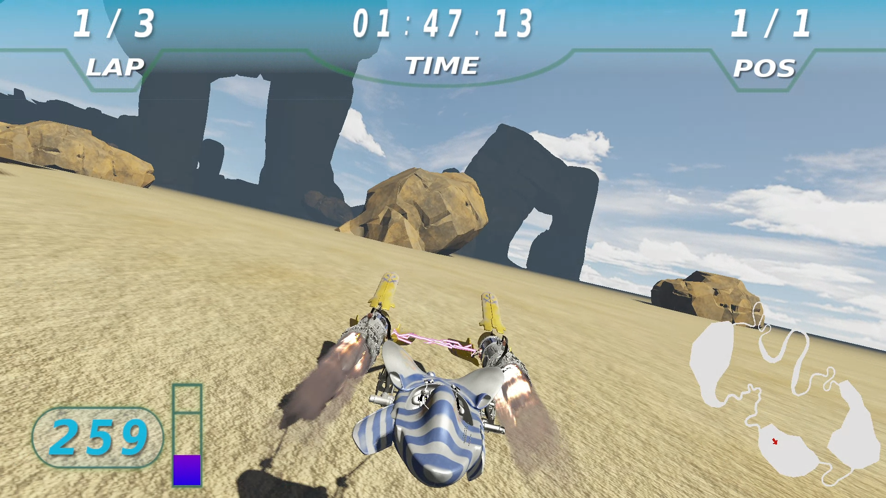

# star_wars_podracer
Mini-game based on the pod race as seen in the phantom menace.

# install dependencies (fedora 31)
Must be performed as root:
+ dnf install SDL2-devel.x86_64
+ dnf install glew-devel.x86_64
+ dnf install assimp-devel.x86_64
+ dnf install openal-soft-devel.x86_64
+ dnf install bullet-devel.x86_64
+ dnf install libsndfile-devel.x86_64

# how to build (GNU/linux systems)
1) in the root directory, create a build directory: mkdir build
2) then type: cmake -G "Unix Makefiles" -B build -S .
3) checkout to build directory: cd build
4) compile: make
5) run: ./Podracer

# screenshot

